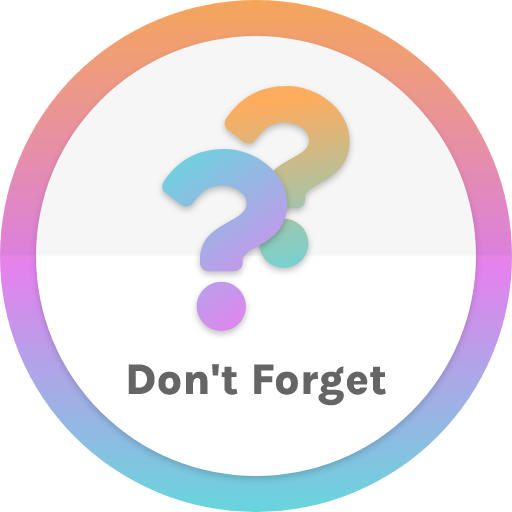
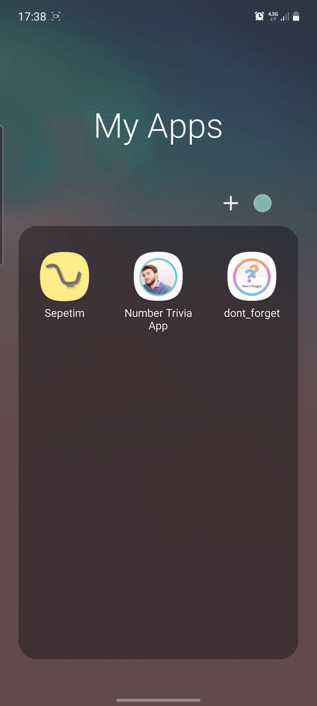

<!-- Badges -->

[![Contributors][contributors-shield]][contributors-url]
[![Repo size][repo-size-shield]][repo-url]
[![MIT License][license-shield]][license-url]
[![LinkedIn][linkedin-shield]][linkedin-url]

# Don't Forget

<!-- Project Logo -->
<p align=center>

<h3 align=center>Don't Forget</h3>
<p align=center>A simple reminder app created with Flutter<p/>
</p>

<!-- Description -->

<br>

## About The Project

Don't Forget is a simple mobile application created with Flutter. It simply helps you to remember if you did something or not and records the update time. The main purpose of developing this simple app for me is to learn bloc state management with clean architecture and testing in Flutter. You can use it as a base architecture of your projects because it is simple, scalable and maintainable.

### Built With

- [Flutter]([flutter-url])

## Getting Started

Don't Forget is a really simple app so that it's easier to understand what is happening under the hood.

<br>
<p align=center></p>

### Prerequisites

You need to have following softwares and frameworks before running the project

- [Flutter Installation](https://flutter.dev/docs/get-started/install)

### Installation

1. Clone the repo
   ```sh
   git clone https://github.com/rtanyildizi/dont-forget.git
   ```
2. Install packages
   ```sh
   flutter pub get
   ```

## Usage

If you want to use the app in your real android device

1. Build release apk
   ```sh
   flutter build apk --release
   ```
2. Copy the apk to your device from `./build/app/outputs/apk/release/app-release.apk`

3. Install apk to your device. You need to allow unknown sources to install the apk.

<!-- _For more examples, please refer to the [Documentation](https://example.com)_ -->

<!-- ## Roadmap

See the [open issues][issues-url] for a list of proposed features (and known issues).

<!-- CONTRIBUTING -->
<!--
## Contributing

Contributions are what make the open source community such an amazing place to be learn, inspire, and create. Any contributions you make are **greatly appreciated**.

1. Fork the Project
2. Create your Feature Branch (`git checkout -b feature/AmazingFeature`)
3. Commit your Changes (`git commit -m 'Add some AmazingFeature'`)
4. Push to the Branch (`git push origin feature/AmazingFeature`)
5. Open a Pull Request -->

<!-- LICENSE -->

## License

Distributed under the MIT License. See `LICENSE` for more information.

<!-- CONTACT -->

## Contributers

<a href='https://github.com/rtanyildizi' target="_blank"><div align=center style='padding: 10px; width: 200px; border: 1px solid white; background-color: #282A36; border-radius: 10px'>


<h4 style='color: white; font-weight: bold'> Nurettin Resul Tanyıldızı </h4>
<p><a href='https://linkedin.com/in/rtanyildizi'>Linkedin</a> - <a href='mailto:tanyildizi.resul@gmail.com'>Gmail</a></p>
</div></a>

<!-- Variables -->

[flutter-url]: https://flutter.dev
[repo-url]: https://github.com/rtanyildizi/dont-forget
[issues-url]: https://github.com/rtanyildizi/dont-forget/issues
[contributors-shield]: https://img.shields.io/github/contributors/rtanyildizi/dont-forget
[contributors-url]: https://github.com/rtanyildizi/dont-forget/graphs/contributors
[repo-size-shield]: https://img.shields.io/github/repo-size/rtanyildizi/dont-forget
[license-shield]: https://img.shields.io/github/license/rtanyildizi/dont-forget
[license-url]: https://github.com/rtanyildizi/dont-forget/blob/main/LICENSE
[linkedin-shield]: https://img.shields.io/badge/LinkedIn-%230072B1?logo=linkedin
[linkedin-url]: https://linkedin.com/in/rtanyildizi
